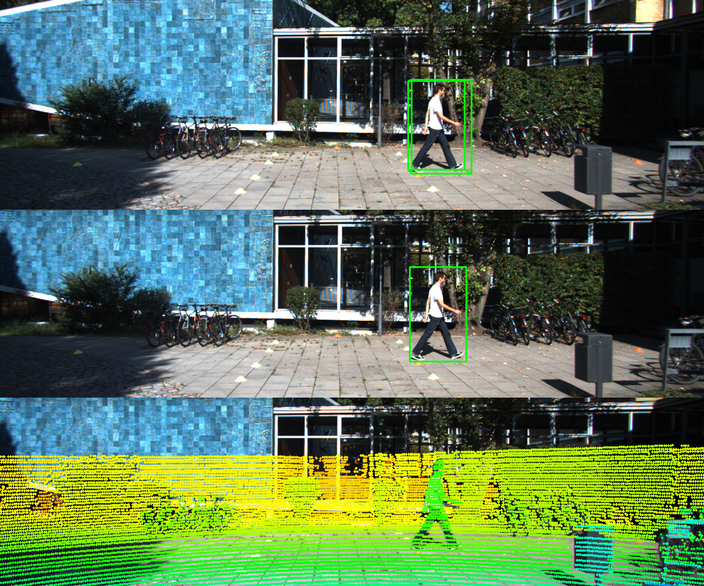
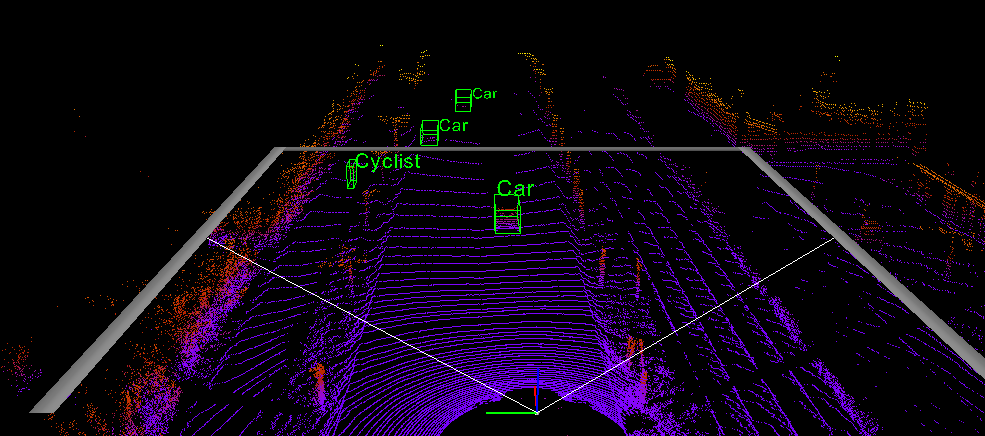

# KITTI Object Data Visualization
Reference : https://github.com/kuixu/kitti_object_vis

## Data Setting
The folder structure is as following:
```
kitti_vis
    data
        object
            training
                calib
                image_2
                label_2
                velodyne
    imgs
    jupyter
    __pycache__
```

## Environment Setting
- start from a new conda enviornment:
```
(base) $ conda create -n kitti_vis python=3.7 # vtk does not support python 3.8
(base) $ conda activate kitti_vis
```
- opencv, pillow, scipy, matplotlib
```
(kitti_vis) $ pip install opencv-python pillow scipy matplotlib
```
- install mayavi from conda-forge, this installs vtk and pyqt5 automatically
```
(kitti_vis) $ conda install mayavi -c conda-forge
```
- test installation
```
(kitti_vis) $ python kitti_object.py --show_lidar_with_depth --img_fov --const_box --vis
```

**Note: the above installation has been tested not work on MacOS.**

## Visualization

```shell
$ python kitti_object.py
```
Specific your own folder,
```shell
$ python kitti_object.py -d /path/to/kitti/object
```

Show LiDAR only
```
$ python kitti_object.py --show_lidar_with_depth --img_fov --const_box --vis
```

Show LiDAR and image (Recommendation)
```
$ python kitti_object.py --show_lidar_with_depth --img_fov --const_box --vis --show_image_with_boxes
```

Show LiDAR and image with specific index
```
$ python kitti_object.py --show_lidar_with_depth --img_fov --const_box --vis --show_image_with_boxes --ind 100 
```

Show LiDAR with label (5 vector)
```
$ python kitti_object.py --show_lidar_with_depth --img_fov --const_box --vis --pc_label
```

## Demo

#### 2D, 3D boxes and LiDar data on Camera image


Credit: @yuanzhenxun

#### LiDar birdview and point cloud (3D)


## Show Predicted Results

Firstly, map KITTI official formated results into data directory
```
./map_pred.sh /path/to/results
```

```python
python kitti_object.py -p --vis
```


## Acknowlegement

Code is mainly from [f-pointnet](https://github.com/charlesq34/frustum-pointnets) and [MV3D](https://github.com/bostondiditeam/MV3D)
